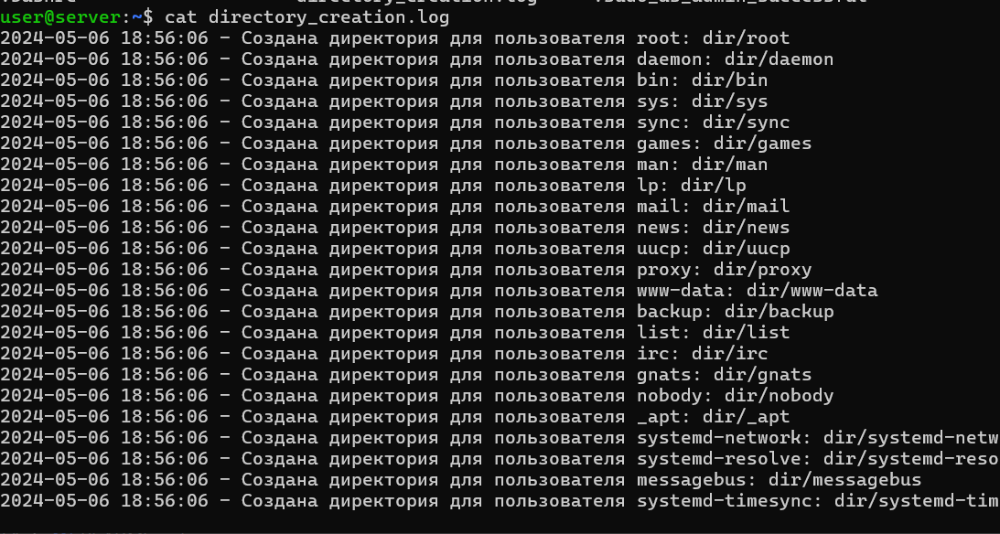

## task1
Задание по bash:
Написать bash скрипт который создаст для всех пользователей системы отдельную директорию в корневой директории с именем пользователя и установит для нее права 755. При этом владельцем директории должен быть соответствующий пользователь. Путь до корневого каталога создания директорий, должен определяться через ключ "-d"  или если ключ не задан то должен быть "диалог" для определения пути пользователем. Лог должен писаться и в stdout и в файл.

## Реализация:
- Сначала скрипт проверяет наличие ключа "-d", который определяет путь к корневой директории создания директорий. Если ключ не указан, скрипт предлагает пользователю ввести путь вручную через диалоговое окно.
- После определения корневой директории скрипт получает список всех пользователей в системе.
- Для каждого пользователя создается отдельная директория в корневой директории с именем пользователя.
- Для каждой созданной директории устанавливаются права доступа 755 (rwxr-xr-x), чтобы пользователь имел полные права на чтение, запись и выполнение, а остальные пользователи имели права только на чтение и выполнение.
- Владельцем каждой директории становится соответствующий пользователь.
- Информация о каждой созданной директории записывается в лог-файл, как в стандартный вывод, так и в файл.

## Запуск
- запуск с несуществующей директорией

- запуск без флага

- запуск с флагом 

- результат работы 

- файл с логами
