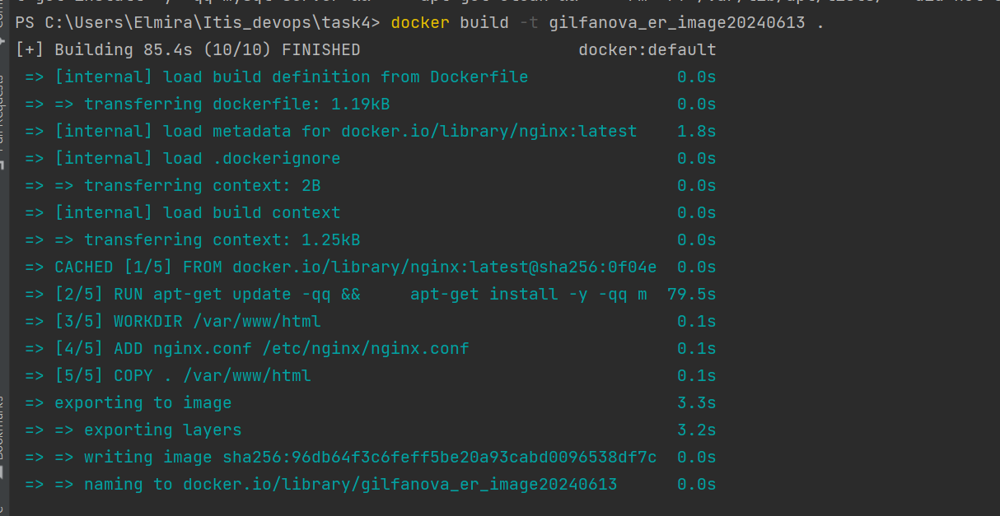
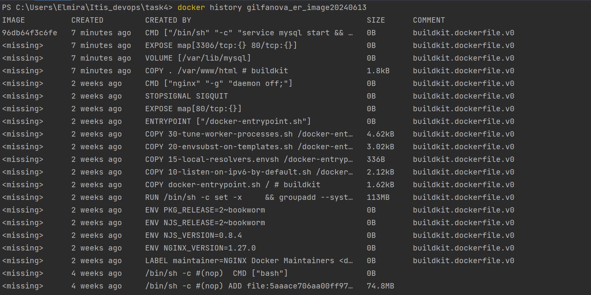
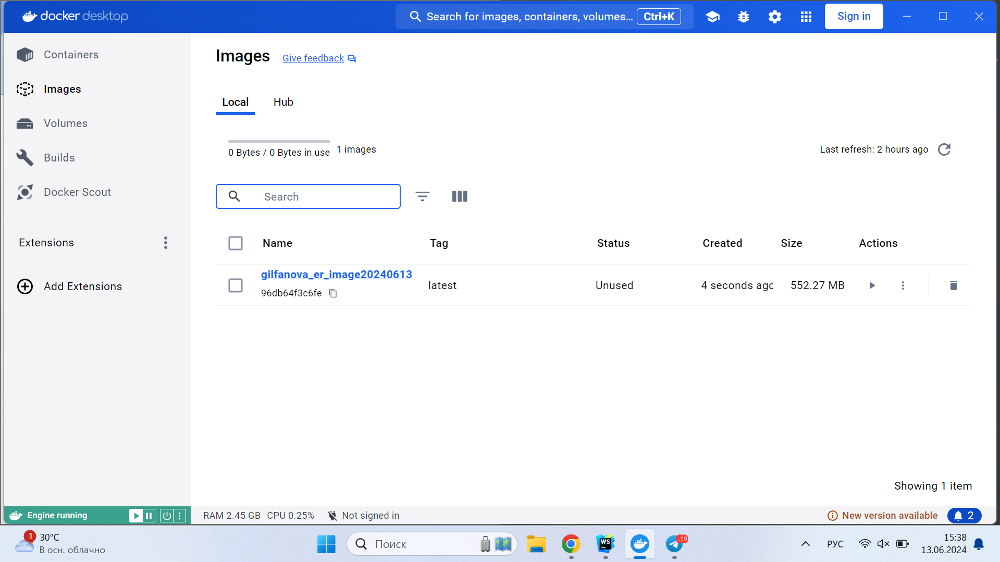

## task4
1) Напишите Dockerfile для создания образа, который будет содержать веб-сервер Apache или Nginx и базу данных MySQL или postgresql. В Dockerfile должны использоваться инструкции: FROM, MAINTAINER, RUN, CMD, WORKDIR, ENV, ADD, COPY, VOLUME, USER, EXPOSE.
   Dockerfile должен содержать комментарии с пояснениями того, что делается.
   Собранный образ должен иметь имя вида <фамилия>_<инициалы>_image_<текущая дата>. Рядом с dockerfile должен быть скрин, на котором будут видны все слои вашего image и их размер на диске и команда, которой вы это выведете.

## запуск

## список слоев и их размеры

